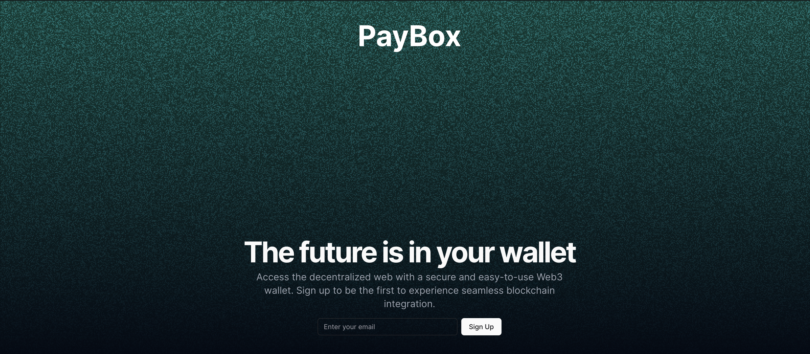

# PayBox - A Next-Generation Crypto Payment and Wallet System



PayBox is an innovative crypto payment and wallet system that indexes cryptocurrency addresses for their transactions and provides real-time audio notifications, such as "Received 1 SOL". This project aims to simplify cryptocurrency transactions and provide a user-friendly interface for managing digital assets.

## Features

- Multi-chain support (Solana, Ethereum, Bitcoin)
- Real-time transaction notifications
- Secure wallet management
- Token creation and management (for Solana)
- Transaction history and analytics
- User-friendly interface

## Prerequisites

- [Node.js](https://nodejs.org/) (v14 or later)
- [Yarn](https://yarnpkg.com/) package manager
- [Turborepo](https://turbo.build/repo/docs) for monorepo management
- [Solana CLI](https://docs.solana.com/cli/install-solana-cli-tools) (for Solana development)
- [Anchor](https://project-serum.github.io/anchor/getting-started/installation.html) (for Solana smart contract development)

## Project Structure

- `packages/`: Shared packages and utilities
  - `blockchain/`: Blockchain interaction logic
  - `common/`: Shared types and utilities
- `backend/`: Backend services
  - `api/`: Main API service
  - `backend-common/`: Shared backend utilities
- `frontend/`: User interface applications

## Getting Started

1. Clone the repository:
   ```bash
   git clone https://github.com/shawakash/payBox.git
   cd payBox
   ```

2. Install dependencies:
   ```bash
   yarn install
   ```

3. Set up environment variables:
   - Copy `.env.example` to `.env` in relevant directories
   - Fill in the required values

4. Build the project:
   ```bash
   yarn build
   ```

5. Start the development servers:
   ```bash
   yarn dev
   ```

## Testing

Run the test suite:

```bash
yarn test
```

## Deployment

Deployment instructions are currently being developed. Please check back later for updates.

## Security Considerations

- Never commit or share private keys or sensitive information
- Use environment variables for all sensitive configuration
- Regularly update dependencies and apply security patches
- Follow best practices for smart contract development and auditing
- Implement proper access controls and input validation

## Contributing

We welcome contributions! Please see our [Contributing Guide](CONTRIBUTING.md) for more details.

## Documentation

- [User Guide](docs/USER_GUIDE.md)
- [API Documentation](docs/API.md)
- [Smart Contract Documentation](docs/SMART_CONTRACTS.md)

## Roadmap

- [ ] Implement additional blockchain integrations
- [ ] Enhance security features
- [ ] Develop mobile applications
- [ ] Integrate with popular DeFi protocols

## License

This project is licensed under the [MIT License](LICENSE).

## Contact

For questions or support, please open an issue or contact the maintainers at [email@example.com](mailto:email@example.com).
